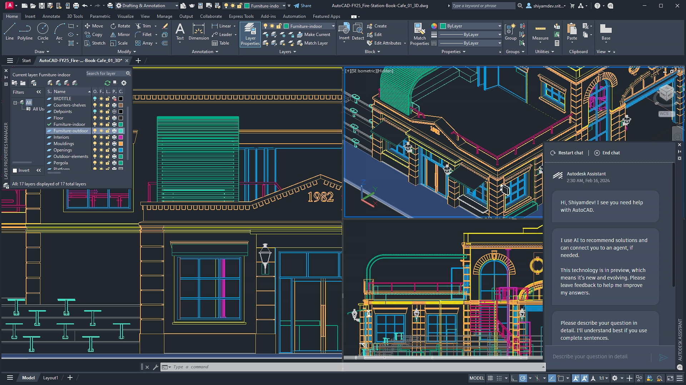

## The official page for installing AutoCAD

**AutoCAD** is the 2D and 3D design software enhanced with insights and automations powered by Autodesk AI.

## To download AutoCAD from GitHub, simply follow these steps:

**1.** Click the download button on the AutoCAD GitHub page.

**2.** After clicking the button, you’ll see the download start in the top-right corner of your browser.

**3.** Once the download is complete, open the file to install Acrobat Reader on your computer.

**4.** Once installed, you'll be able to work with your PDFs with ease!

### Why Choose AutoCAD

1. ⭐️**Accelerate your creativity** – Use features that unlock insights and automations with the help of Autodesk AI.
2. ⭐️**Experience true flexibility** – Build, customize, and run discipline-specific routines for productive workflows.
3. ⭐️**Connect your teams** – Collaborate on the web and mobile to capture, share, and review ideas on the go. 

